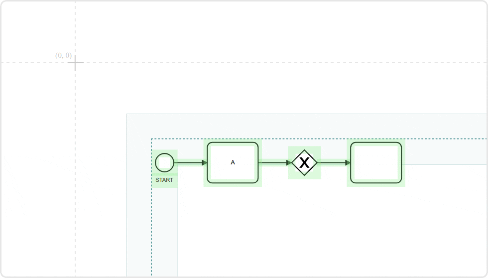

# @bpmn-io/align-to-origin

[](https://travis-ci.com/bpmn-io/align-to-origin)

Plugs into your favorite [BPMN](https://github.com/bpmn-io/bpmn-js), [DMN](https://github.com/bpmn-io/dmn-js) and [CMMN](https://github.com/bpmn-io/cmmn-js) editor. Adds the ability to align diagrams to the coordinate origin `(0,0)`, optionally on save.




## Usage

```javascript
import BpmnModeler from 'bpmn-js/lib/Modeler';

import AlignToOrigin from '@bpmn-io/align-to-origin';


// extend the BPMN editor with the exporter module
var modeler = new BpmnModeler({
  alignToOrigin: {
    alignOnSave: true
  },
  additionalModules: [
    AlignToOrigin
  ]
});


// hooks into #saveXML to align the diagram elements
modeler.saveXML(function(err, xml) {
  ...
});

// may be used standalone, too
var alignToOrigin = modeler.get('alignToOrigin');

alignToOrigin.align();
```


## License

MIT